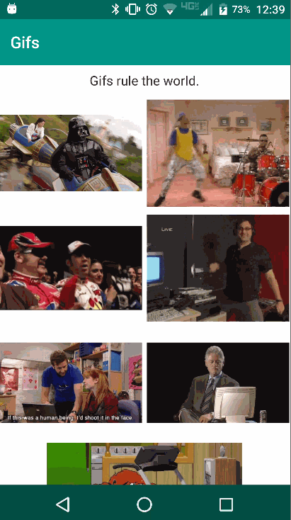

<a align="center" href="https://www.npmjs.com/package/nativescript-gif">
    <h3 align="center">NativeScript-Gif</h3>
</a>
<h4 align="center">NativeScript plugin to use GIFs in your application.</h4>

<p align="center">
 <a href="https://www.npmjs.com/package/nativescript-gif">
        
    </a>
    <a href="https://www.npmjs.com/package/nativescript-gif">
        
    </a>
    <a href="https://www.npmjs.com/package/nativescript-gif">
        
    </a>
    <br />
    <a href="http://nstudio.io">
      
    </a>
     <br />
    <h5 align="center">Do you need assistance on your project or plugin? Contact the nStudio team anytime at <a href="mailto:team@nstudio.io">team@nstudio.io</a> to get up to speed with the best practices in mobile and web app development.
    </h5>
</p>

---

## Installation

`tns plugin add nativescript-gif`

The native libraries used to handle rendering GIFs for Android & iOS.

| Android Library                                                                   | iOS CocoaPod                                                                 |
| --------------------------------------------------------------------------------- | ---------------------------------------------------------------------------- |
| [Koral-- / android-gif-drawable](https://github.com/koral--/android-gif-drawable) | [FLAnimatedImage by Flipboard](https://github.com/Flipboard/FLAnimatedImage) |

| Android Screen                           | iOS Screen                          |
| ---------------------------------------- | ----------------------------------- |
|  |  |

## Usage

#### Plain NativeScript

<span style="color:red">IMPORTANT: </span>_Make sure you include
`xmlns:Gif="nativescript-gif"` on the Page element._

```XML
<Page xmlns="http://schemas.nativescript.org/tns.xsd"
      xmlns:Gif="nativescript-gif" loaded="pageLoaded">
  <StackLayout>
    <Gif:Gif headers="{{headersJSON}}" src="~/gifs/bill.gif" height="100" />
    <Gif:Gif src="https://media4.giphy.com/media/3uyIgVxP1qAjS/200.gif" height="200" />
  </StackLayout>
</Page>
```

### NativeScript Angular

```typescript
import { registerElement } from 'nativescript-angular/element-registry';
import { Gif } from 'nativescript-gif';
registerElement('Gif', () => Gif);
```

##### HTML

```HTML
<StackLayout>
    <Gif [headers]="headersJSON" src="~/gifs/bill.gif" height="100" ></Gif>
    <Gif src="https://media4.giphy.com/media/3uyIgVxP1qAjS/200.gif" height="200" ></Gif>
</StackLayout>
```

### Bundling Note:

Demo app sample: https://github.com/bradmartin/nativescript-gif/blob/master/demo/webpack.config.js#L218
Be sure that you have your `.gifs` added to the globs of the CopyWebpackPlugin as part of your webpack.config.

```javascript
{
  from: {
    glob: '**/*.gif';
  }
}
```

## Properties

- **src** - _required_
  Set the gif file to play.

- **headers - (JSON Object)** - _optional_
  Set headers to add when loading a gif from URL

## API

##### start()

- starts playing the .gif

##### stop()

- stops playing the .gif

##### getFrameCount()

- returns the number of frames in the current .gif

##### isPlaying()

- returns boolean value indicating if the gif is playing.

---

###### _Android Only_

##### getDuration()

- returns the .gif duration

##### reset()

- resets the .gif to its initial frame

##### setSpeed(speedFactor: _Number_)

- sets the .gif play speed

##### recycle()

- provided to speed up freeing memory <small>_advanced usage - you shouldn't need this often_</small>
